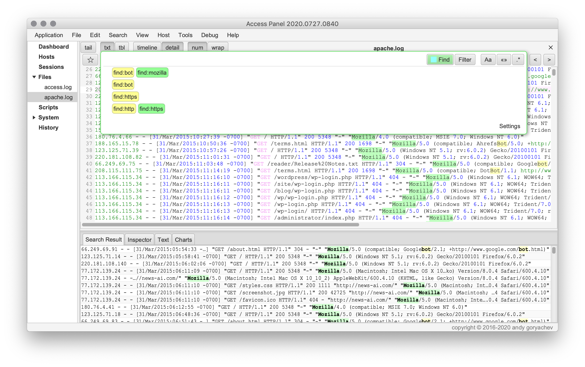
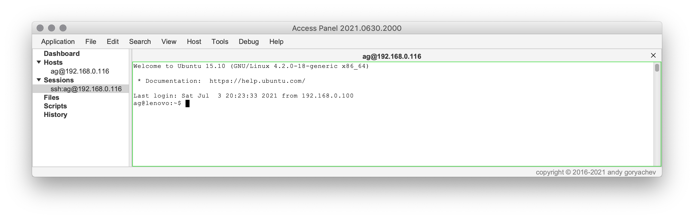
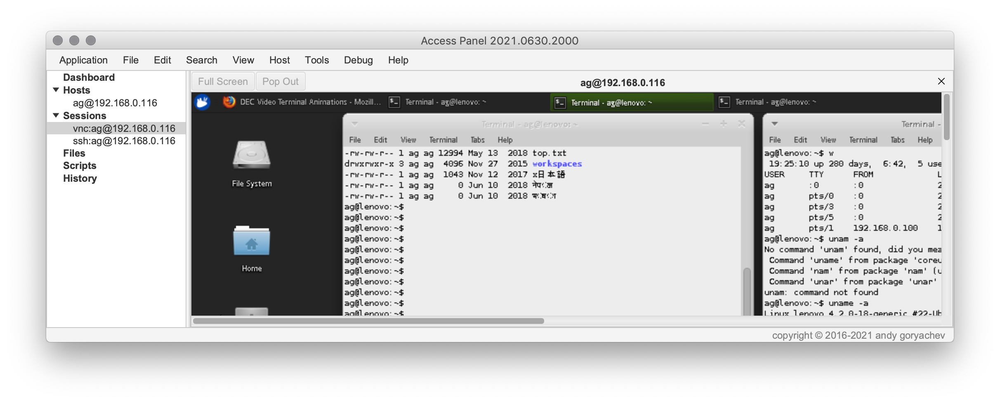

# Access Panel

## Features

* encrypted credentials, keys, temporary files
* log viewer
* multiple ssh terminals
* vnc viewer
* file manager
* script runner
* linux configuration tools

## Security

* credentials, keys, local files are **encrypted locally**
* temporary files are encrypted with ephemeral keys
* configurable application window lock

## Log Viewer

* works with local and remote files
* timeline
* tailing
* advanced search with regex, wildcards, and highlights 
* date queries
* extract and plot variables
* file alignment
* table view for CSV/TSV files

## SSH Terminals

* unicode support
* workspace remembers and restores terminal connections and layout
* multiple terminals, tabbed or in external window(s)

## VNC Viewer

* internal tab or external window
* remembers layout

## File Manager

* local and remote filesystems
* synchronizes directories
* copy, rename, move directories and files
* file preview

## Script Runner

* a convenient UI for running commands on one or more hosts
* variables, secrets
* captures timestamps

## Linux Configuration Tools

* GUI for Linux components (iptables, nginx, apache, ...)
* multi-server command executor with variables and scripting
* GUI for common tasks like let's encrypt, zip and download logs, ...

## Other Features

* workspace remembers and reloads sessions and files
* history view for convenience or audit logging
